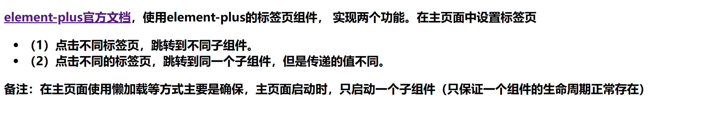

### 2024.10.21 - 10.27周报

+ 本周对Vue学了个大概，前一周学的Vue2，本周在往Vue3的写法上靠，大致学习了官方文档以下内容：
  + 响应式基础，计算属性，类与样式绑定，条件渲染，列表渲染，事件处理，表单输入绑定，生命周期，侦听器，注册，Props，事件，以及一点路由配置
+ **郭师兄**给了我点任务，写到现在还有一个BUG没修好，任务如下:

+ 还有一些BUG没解决：

  + 似乎没有组件有生命周期
  + 我写的代码感觉是静态的，点击哪个Tags就放出提前渲染好的component页面，并不是动态的，这样感觉会对页面性能损耗的比较严重。

+ 以下是任务代码：

  + App.vue:

  + ```vue
    <template>
      <nav>
        <router-link to="/">Home</router-link>
      </nav>
      <el-tabs
        type="card"
        class="demo-tabs"
        v-model="activeName"
        @click="outInfo"
      >
        <el-tab-pane label="Tab1" name="tab1" >
          <ChildComponent1></ChildComponent1>
        </el-tab-pane>
        <el-tab-pane label="Tab2" name="tab2">
          <ChildComponent2></ChildComponent2>
        </el-tab-pane>
        <el-tab-pane label="Tab3" name="tab3">
          <ChildComponent3></ChildComponent3>
        </el-tab-pane>
        <el-tab-pane label="Tab4" name="tab4">
          <NewComponent></NewComponent>
        </el-tab-pane>
        <el-tab-pane label="Tab5" name="tab5">
          <NewComponent></NewComponent>
        </el-tab-pane>
        <el-tab-pane label="Tab6" name="tab6">
          <NewComponent></NewComponent>
        </el-tab-pane>
      </el-tabs> <br> <br> <br> <br>
    </template>
    
    <script> 
    import ChildComponent1 from '@/components/ChildComponent1.vue';
    import ChildComponent2 from '@/components/ChildComponent2.vue';
    import ChildComponent3 from '@/components/ChildComponent3.vue';
    import NewComponent from '@/components/NewComponent.vue';
    import { reactive, ref } from 'vue';
    
    export default {
      components: {
        ChildComponent1,
        ChildComponent2,
        ChildComponent3,
        NewComponent
      }, 
      setup() {
        const activeName = ref('tab1')
        
        function outInfo() {
          console.log(activeName.value)
          console.log('hello')
        }
    
        return {
          activeName,
          outInfo,
        }
      }
    }
    </script>
    <style>
    .demo-tabs > .el-tabs__content {
      padding: 32px;
      color: #6b778c;
      font-size: 32px;
      font-weight: 600;
    }
    #app {
      font-family: Avenir, Helvetica, Arial, sans-serif;
      -webkit-font-smoothing: antialiased;
      -moz-osx-font-smoothing: grayscale;
      text-align: center;
      color: #2c3e50;
    }
    nav {
      padding: 30px;
    }
    nav a {
      font-weight: bold;
      color: #2c3e50;
    }
    nav a.router-link-exact-active {
      color: #42b983;
    }
    </style>
    ```

  + Router/index.js

  + ```js
    import { createRouter, createWebHistory } from 'vue-router'
    import HomeView from '../views/HomeView.vue'
    import ChildComponent1 from '@/components/ChildComponent1.vue';
    import ChildComponent2 from '@/components/ChildComponent2.vue';
    import ChildComponent3 from '@/components/ChildComponent3.vue';
    
    const routes = [
      {
        path: '/',
        name: 'home',
        component: HomeView
      },
    ]
    
    const router = createRouter({
      history: createWebHistory(process.env.BASE_URL),
      routes
    })
    
    export default router
    ```


