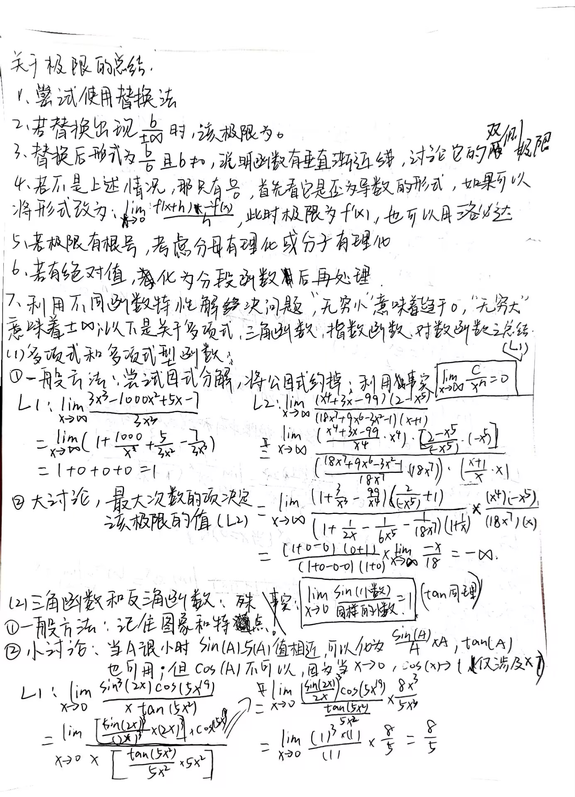
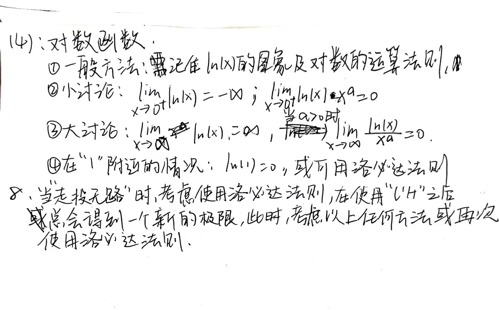

### 2024.10.7 - 10.13 周报

+ 1、将前端三件套(html，CSS、JS)基本语法以及功能大致学完。并用HTML和CSS简单制作了一个小网站。
+ 2、将极限相关问题做了一个简单的整理，将一些简单类型以及基本初等函数的极限归纳总结了一番。
+ 3、下周任务目标
  + 学习VUE2，并准备做一个VUE的项目来熟悉VUE架构。
  + 之前的个人Blog网站: https://thelight-ccf.github.io/ 长时间没维护，打算重新搭建一个个人Blog，预计Blog域名：blog.frostmoonbird.com

1、成品图

2、总结图

