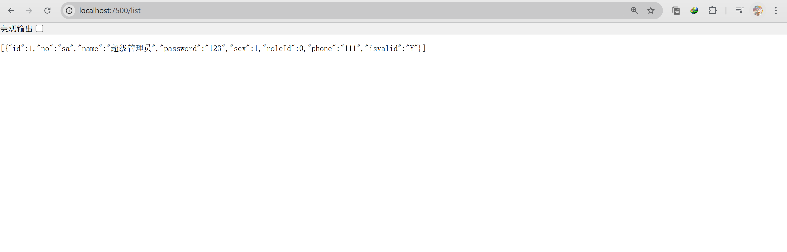

### 2024.11.18-11.24周报

+ 本周大体学完了SpringBoot，开始了vue+springboot的前后端分离项目
+ 开始了一个仓库管理系统的开发

#### 后端

+ mybatis-plus支持

```xml
<dependency>
    <groupId>com.baomidou</groupId>
    <artifactId>mybatis-plus-spring-boot3-starter</artifactId>
    <version>3.5.9</version>
</dependency>
```

+ 创建mysql表

```mysql
create table user 
(
  id        int auto_increment comment '主键' 
        primary key,
  no        VARCHAR(20)            NULL comment '账号',
  name      VARCHAR(100)           not null comment '名字',
  password  VARCHAR(20)            not null comment '密码',
  age       int                    null,
  sex       int                    null comment '性别',
  phone     VARCHAR(20)            null comment '电话',
  role_id   int                    null comment  '角色 0超级管理员，1管理员，2普通账号',
  isValid   VARCHAR(4) DEFAULT 'Y' null comment '是否有效，Y有效，其他无效'
)
  charset = utf8mb4;
```

+ 编写application.yml启动文件

```yml
server:
  port: 7500

spring:
  datasource:
    url: jdbc:mysql://localhost:3306/wms?useUnicode=true&characterEncoding=utf8mb4&useSSL=false&useSSL=false&serverTimezone=GMT%2B8
    driver-class-name: com.mysql.cj.jdbc.Driver
    username: root
    password: Aa2580936416
```

+ 测试代码

  + 实体类

  + ```java
    @Data
    public class User {
        private int id;
        private String no;
        private String name;
        private String password;
        private int sex;
        private int roleId;
        private String phone;
        private String isvalid;
    }
    ```

  + mapper接口

  + ```java
    @Mapper
    public interface UserMapper extends BaseMapper<User> {
        List<User> listAll();
    }
    ```

  + service实现类

  + ```java
    //UserService.java
    @Service
    public interface UserService extends IService<User> {
        List<User> listAll();
    }
    
    //UserServiceImpl.java
    @Service
    public class UserServiceImpl extends ServiceImpl<UserMapper, User> implements UserService {
    
        @Resource
        private UserMapper userMapper;
        @Override
        public List<User> listAll() {
            return userMapper.listAll();
        }
    }
    ```

  + 创建配置文件

  + ```xml
    <!-- UserMapper.xml -->
    <?xml version="1.0" encoding="UTF-8"?>
    <!DOCTYPE mapper PUBLIC "-//mybatis.org//DTD Mapper 3.0//EN"
    "http://mybatis.org/dtd/mybatis-3-mapper.dtd">
    <mapper namespace="com.wsm.mapper.UserMapper">
        <select id="listAll" resultType="com.wsm.entity.User">
            select * from user
        </select>
    </mapper>
    ```

+ 数据表查询:



+ 下周争取把这个项目做完，然后去看高中选课系统的代码。