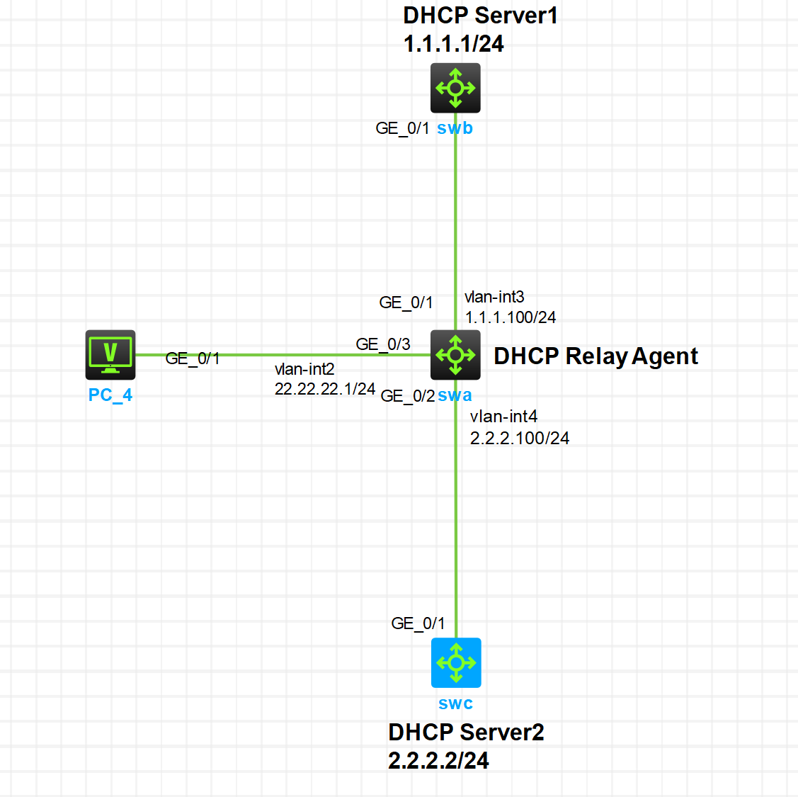

<center><h2>
    DHCP Relay(中继服务部署)
    </h2></center>

#### 1.DHCP中继，组网需求

+ DHCP客户端所在网段为22.22.22.0/24；
+ 由于DHCP客户端和DHCP服务器不在同一网段，需要在客户端所在网段设置DHCP中继，以便DHCP客户端可以从DHCP服务器申请到22.22.22.0/24网段的IP地址及相关配置信息；
+ DHCP中继Switch A通过VLAN接口2连接到DHCP客户端所在的网络，VLAN接口2的IP地址为22.22.22.1/24，通过VLAN接口3连接Switch B，VLAN接口3的IP地址为1.1.1.100/24，通过VLAN接口4连接Switch C，VLAN接口4的IP地址为2.2.2.100/24；
+ Switch B配置了22.22.22.0网段的地址池，但未开启DHCP服务；Switch C配置了22.22.22.0网段的地址池，也未开启DHCP服务。

#### 2.网络拓扑图：



#### 3.配置步骤

(1)   配置各设备上各接口的IP地址。

(2)   配置DHCP服务器Switch B和Switch C。

(3)   配置DHCP中继Switch A。

```cmd
# SwA
## 开启DHCP服务。
[SWA]dhcp enable
## 配置VLAN接口2工作在DHCP中继模式。
[SWA]int vlan 2
[SWA-Vlan-interface2]dhcp select relay
# 指定DHCP服务器的IP地址。
[SWA-Vlan-interface2]dhcp relay server-address 1.1.1.1
[SWA-Vlan-interface2]dhcp relay server-address 2.2.2.2
# 指定DHCP中继选择DHCP服务器方式为主备方式。
[SWA-Vlan-interface2]dhcp relay server-address algorithm master-backup
# 配置回切主用DHCP服务器并指定回切延迟时间为3分钟。
[SWA-Vlan-interface2]dhcp relay master-server switch-delay 3
```


