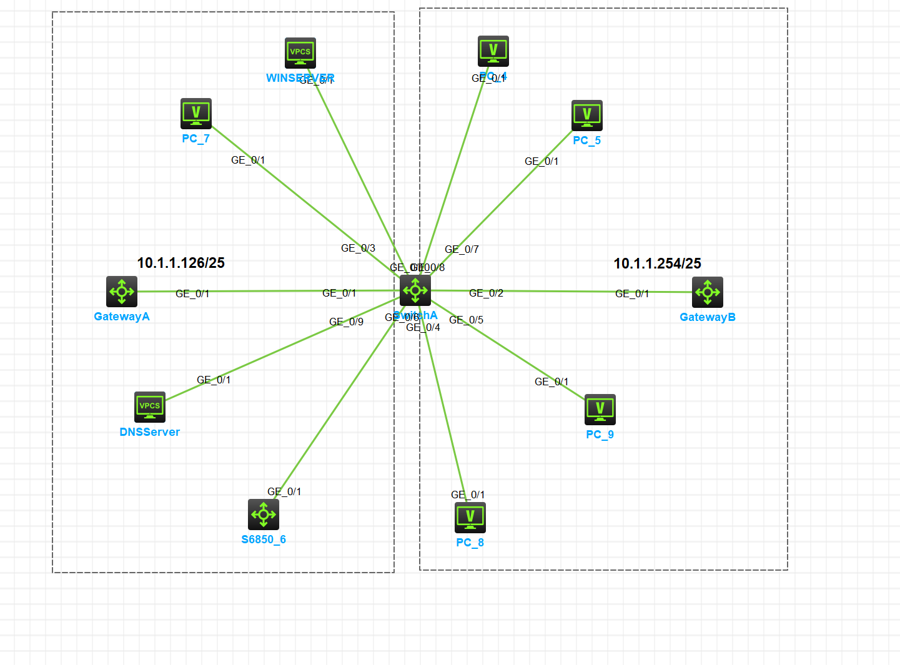

<center><h2>
    DHCP动态分配地址
    </h2></center>

#### 1.组网需求

+ 作为DHCP服务器的Switch A为网段10.1.1.0/24中的客户端动态分配IP地址，该地址池网段分为两个子网网段。
  10.1.1.0/25和10.1.1.128/25;
+ Switch A的两个VLAN接口，VLAN接囗10和VLAN接口20的地址分别为10.1.1.1/25和10.1.1.129/25;
+ 10.1.1.0/25网段内的地址租用期限为10天12小时，域名后缀为aabbcc.com，DNS服务器地址为10.1.1.2/25，WINS服务器地址为10.1.1.4/25，网关的地址为10.1.1.126/25;
+ 10.1.1.128/25网段内的地址租用期限为5天，域名后缀为aabbcc.com，DNS服务器地址为10.1.1.2125，无WINS服务器地址，网关的地址为10.1.1.254/25.

### 2.组网图

DHCP组网图:

_

### 3.配置步骤

+ 配置端口属于VLAN及对应VLAN接口的IP地址

```cmd
#GatewayA
[GatewayA]interface GE1/0/1
[GatewayA-GigabitEthernet1/0/1]port link-mode route
The configuration of the interface will be restored to the default. Continue? [Y/N]:y

[GatewayA-GigabitEthernet1/0/1]ip add 10.1.1.126 25
```

```cmd
#Gateway B
[GatewayB]int ge1/0/1
[GatewayB-GigabitEthernet1/0/1]port link-mode route
The configuration of the interface will be restored to the default. Continue? [Y/N]:y

[GatewayB-GigabitEthernet1/0/1]ip add 10.1.1.254 25
```

```cmd
#Switch A
[SwitchA]vlan 10
[SwitchA-vlan10]vlan 20

[SwitchA]int Vlan-interface 10
[SwitchA-Vlan-interface10]ip add 10.1.1.1 25
[SwitchA]int Vlan-interface 20
[SwitchA-Vlan-interface20]ip add 10.1.1.129 25
```

```cmd
#Switch B
[SwitchB]vlan 10
```

+ 配置DHCP服务

```cmd
#Switch A
# 配置不参与自动分配的IP地址（DNS服务器、WINS服务器和网关地址）
[SwitchA]dhcp server forbidden-ip 10.1.1.2
[SwitchA]dhcp server forbidden-ip 10.1.1.4
[SwitchA]dhcp server forbidden-ip 10.1.1.126
[SwitchA]dhcp server forbidden-ip 10.1.1.254
# 配置DHCP地址池1，用来为10.1.1.0/25网段内的客户端分配IP地址和网络配置参数。
[SwitchA]dhcp server ip-pool 1
[SwitchA-dhcp-pool-1]network 10.1.1.0 mask 255.255.255.128
[SwitchA-dhcp-pool-1]expired day 10 hour 12
[SwitchA-dhcp-pool-1]domain-name aabbcc.com
[SwitchA-dhcp-pool-1]dns-list 10.1.1.2
[SwitchA-dhcp-pool-1]gateway-list 10.1.1.126
[SwitchA-dhcp-pool-1]nbns-list 10.1.1.4
[SwitchA-dhcp-pool-1]q
#配置DHCP地址池2，用来为10.1.1.128/25网段内的客户端分配IP地址和网络配置参数。
[SwitchA]dhcp server ip-pool 2
[SwitchA-dhcp-pool-2]network 10.1.1.128 mask 255.255.255.128
[SwitchA-dhcp-pool-2]expired day 5
[SwitchA-dhcp-pool-2]domain-name aabbcc.com
[SwitchA-dhcp-pool-2]dns-list 10.1.1.2
[SwitchA-dhcp-pool-2]gateway-list 10.1.1.254
[SwitchA-dhcp-pool-2]q
# 开启DHCP服务。
[SwitchA]dhcp enable
# 配置VLAN接囗10和VLAN接囗20工作在DHCP服务器模式。
[SwitchA]int Vlan-interface 10
[SwitchA-Vlan-interface10]dhcp select server
[SwitchA-Vlan-interface10]q
[SwitchA]int Vlan-interface 20
[SwitchA-Vlan-interface20]dhcp select server
[SwitchA-Vlan-interface20]q

```


