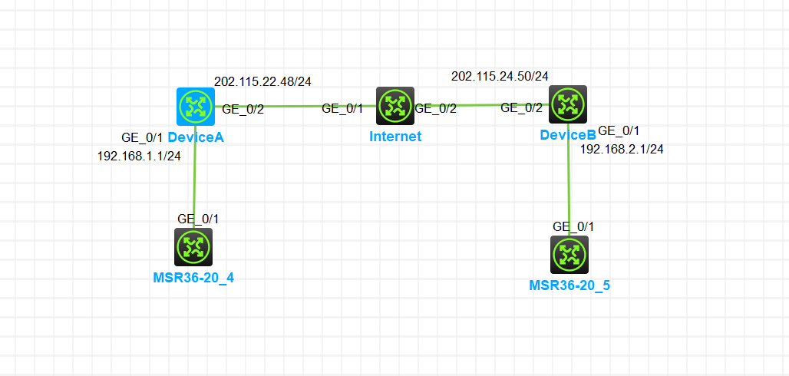

<center><h2>
    GRE OVER IPSEC配置实例
    </h2></center>

#### 1.组网需求：对通过GRE隧道的数据进行IPsec加密处理

+ 网络拓扑图如下



#### 2.配置思路

+ 为了对经GRE封装的数据进行IPsec加密，将IPsec策略应用在物理接口上，访问控制列表源和目的地址为物理接口地址。
+ 为了使IPsec保护整个GRE隧道，应用IPsec策略的接口和GRE隧道源、目的接口必须是同一接口。

#### 3.配置步骤

+ Device A的设置

```cmd
#Device A
## (1) 配置各接口IP地址 , 配置接口GigabitEthernet0/1和GigabitEthernet0/2的IP地址。
[Device A]int GigabitEthernet 0/1
[Device A-GigabitEthernet0/1]ip add 192.168.1.1 255.255.255.0
[Device A-GigabitEthernet0/1]int g0/2
[Device A-GigabitEthernet0/2]ip add 202.155.22.48 255.255.255.0
## (2) 配置GRE隧道
# 创建Tunnel0接口，并指定隧道模式为GRE over IPv4隧道。
[Device A]int tunnel 0 mode gre
# 配置Tunnel0接口的IP地址为10.1.1.1/24.
[Device A-Tunnel0]ip add 10.1.1.1 255.255.255.0
# 配置Tunne10接口的源端地址为202.115.22.48/24(Device A的GigabitEthemnet1/0/2的IP地址)。
[Device A-Tunnel0]source 202.115.22.48
# 配置Tunnel0接口的目的端地址为202.115.24.50/24(Device B的GigabitEthernet1/0/2的IP地址)。
[Device A-Tunnel0]description 202.115.24.50
[Device A-Tunnel0]quit
#配置从Device A经过Tunnel0接口到Remote ofice network的静态路由。
[Device A]ip route-static 192.168.2.1 255.255.255.0 Tunnel 0
## (3) 配置IPsec VPN
# 配置lKE keychain.
[Device A]ike keychain keychain1
[Device A-ike-keychain-keychain1]pre-shared-key add 202.115.24.50 255.255.255.0 key simple 123
[Device A-ike-keychain-keychain1]quit
# 创建ACL3000，定义需要IPsec保护的数据流。
[Device A]acl number 3000
[Device A-acl-ipv4-adv-3000]rule 0 permit gre source 202.115.22.48 0 destination 202.115.24.50 0
[Device A-acl-ipv4-adv-3000]quit
# 配置IPsec安全提议。
[Device A]ipsec transform-set tran1
[Device A-ipsec-transform-set-tran1]esp encryption-algorithm des
[Device A-ipsec-transform-set-tran1]esp authentication-algorithm sha1
[Device A-ipsec-transform-set-tran1]quit
# 创建一条|KE协商方式的IPsec安全策略，名称为policy1，序列号为1。
[Device A]ipsec policy policy1 1 isakmp
[Device A-ipsec-policy-isakmp-policy1-1]security acl 3000
[Device A-ipsec-policy-isakmp-policy1-1]remote-address 202.115.24.50
[Device A-ipsec-policy-isakmp-policy1-1]transform-set tran1
[Device A-ipsec-policy-isakmp-policy1-1]quit
# 在接口GigabitEthernet0/2上应用安全策略。
[Device A]int GigabitEthernet 0/2
[Device A-GigabitEthernet0/2]ipsec apply policy policy1
[Device A-GigabitEthernet0/2]quit
```

+ Device B的设置

```cmd
# Device B
## (1) 配置各接口IP地址
[Device B]int GigabitEthernet 0/1
[Device B-GigabitEthernet0/1]ip add 192.168.2.1 255.255.255.0
[Device B-GigabitEthernet0/1]int ge0/2
[Device B-GigabitEthernet0/2]ip add 202.115.24.50 255.255.255.0
## (2) 配置GRE隧道
[Device B]int tunnel 0 mode gre
[Device B-Tunnel0]ip add 10.1.1.2 255.255.255.0
[Device B-Tunnel0]source 202.115.24.50
[Device B-Tunnel0]description 202.115.22.48
[Device B-Tunnel0]quit
[Device B]ip route-static 192.168.1.1 255.255.255.0 Tunnel 0
## (3) 配置 IPsec VPN
[Device B]ike keychain keychain1
[Device B-ike-keychain-keychain1]pre-shared-key add 202.115.22.48 255.255.255.0 key simple 123
[Device B-ike-keychain-keychain1]quit

[Device B]acl number 3000
[Device B-acl-ipv4-adv-3000]rule 0 permit gre source 202.115.24.50 0 destination
 202.115.22.48 0
 
[Device B]ipsec transform-set tran1
[Device B-ipsec-transform-set-tran1]esp encryption-algorithm des
[Device B-ipsec-transform-set-tran1]esp authentication-algorithm sha1

[Device B]ipsec policy policy1 1 isakmp
[Device B-ipsec-policy-isakmp-policy1-1]security acl 3000
[Device B-ipsec-policy-isakmp-policy1-1]remote-address 202.115.22.48
[Device B-ipsec-policy-isakmp-policy1-1]transform-set tran1

[Device B]int ge0/2
[Device B-GigabitEthernet0/2]ipsec apply policy policy1
```

