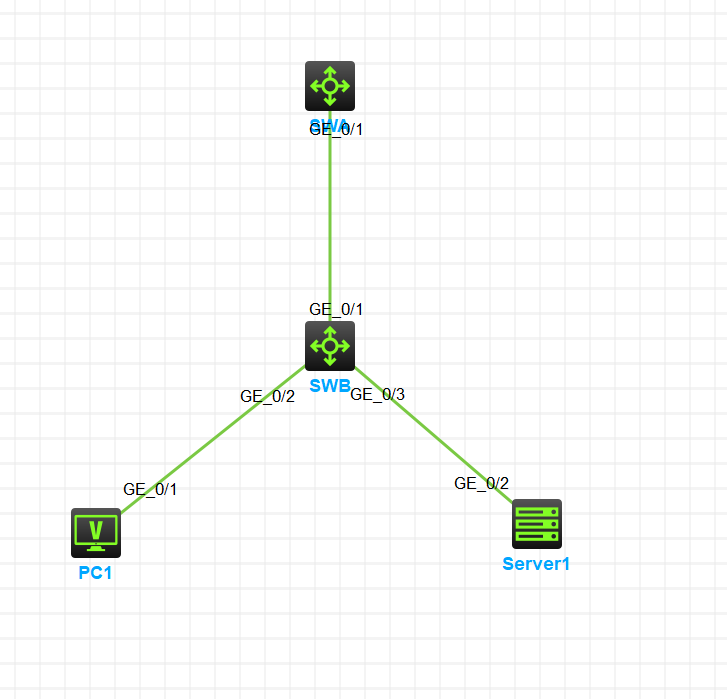

<center><h2>
    按VLAN开启DHCP Snooping配置
    </h2></center>

#### 1. 组网需求

Switch B通过以太网端口Twenty-FiveGigE1/0/1连接到合法DHCP服务器，通过以太网端口Twenty-FiveGigE1/0/3连接到非法DHCP服务器，通过Twenty-FiveGigE1/0/2连接到DHCP客户端。要求：

+ VLAN 100上与合法DHCP服务器相连的端口可以转发DHCP服务器的响应报文，而其他端口不转发DHCP服务器的响应报文。

+ 记录DHCP-REQUEST报文和信任端口收到的DHCP-ACK报文中DHCP客户端IP地址及MAC地址的绑定信息。

#### 2. 组网图



#### 3.配置步骤

```CMD
#Device B
# 配置端口G1/0/1、G1/0/2和G1/0/3为Access端口，允许VLAN 100通过。
[SWB]vlan 100
[SWB-vlan100]port g1/0/1 to g1/0/3
# 在VLAN100内开启DHCP Snooping功能。
[SWB]dhcp snooping enable vlan 100
# 指定端口G1/0/1为VLAN 100下DHCP Snooping功能的信任端口。
[SWB-vlan100]dhcp snooping trust int g1/0/1
# 在VLAN 100内开启DHCP Snooping表项记录功能。
[SWB-vlan100]dhcp snooping binding record
```

