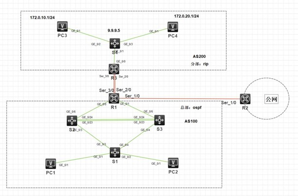

<center><h2>
    样题二
    </h2></center>


<center><h3>第一部分 赛题说明</h3></center>

1．项目描述

某公司在北京建立了总部，后在上海建立了分支机构。总部设有研发、市场、供应链、售后等4个部门，统一进行IP及业务资源的规划和分配。

公司规模在2021年快速发展，业务数据量和公司访问量增长巨大。为了更好管理数据，提供服务，公司决定建立自己的小型数据中心及云计算服务平台，以达到快速、可靠交换数据，以及增强业务部署弹性的目的。

2．网络拓扑规划

请根据拓扑图完成设备连接。



| 源设备名称 | 设备接口 | 目标设备名称 | 设备接口 |
| ---------- | -------- | ------------ | -------- |
| S1         | G1/0/1   | PC1          |          |
| S1         | G1/0/2   | PC2          |          |
| S1         | G1/0/3   | S2           | G1/0/3   |
| S1         | G1/0/4   | S3           | G1/0/4   |
| S2         | G1/0/23  | S3           | G1/0/23  |
| S2         | G1/0/24  | S3           | G1/0/24  |
| S2         | G1/0/6   | R1           | G0/0     |
| S3         | G1/0/6   | R1           | G0/1     |
| R1         | S2/0     | R3           | S2/0     |
| R1         | S3/0     | R3           | S3/0     |
| R1         | S1/0     | R2           | S1/0     |
| R3         | G0/0     | S4           | G0/1     |
| S4         | G1/0/2   | PC3          |          |
| S4         | G1/0/3   | PC4          |          |

<center><h3>
    第二部分  部署数据中心网络
    </h3></center>

#### 一、竞赛要求：

+ **1、PPP部署**

  + 总部路由器与分部路由器间，总部路由器与办事处路由器间属于广域网链路。需要使用PPP。

    PPP的具体要求如下：

    + R1和R3之间做MP-Group，并且做双向验证，R1用户名为R1，R3用户名为R3，密码均为H3C

```cmd
#R1: //在R1上配置对端R3的用户
[R1]local-user R3 class network
[R1-luser-network-R3]password simple H3C
[R1-luser-network-R3]service-type ppp

[R1-luser-network-R3]domain system
[R1-isp-system]authentication ppp local

[R1-isp-system]int s2/0
[R1-Serial2/0]ppp authentication-mode chap domain system
[R1-Serial2/0]ppp chap password simple H3C
[R1-Serial2/0]ppp chap user R1
[R1-Serial2/0]ppp mp MP-group 1

[R1]int s3/0
[R1-Serial3/0]ppp authentication-mode chap domain system
[R1-Serial3/0]ppp chap password simple H3C
[R1-Serial3/0]ppp chap user R1
[R1-Serial3/0]ppp mp MP-group 1

[R1]int mp-group1
[R1-MP-group1]ip add 20.0.0.1 255.255.255.0
```

```cmd
#R3 	在R3上配置对端R1的用户
[R3]local-user R1 class network
[R3-luser-network-R1]password simple H3C
[R3-luser-network-R1]service-type ppp

[R3-luser-network-R1]domain system
[R3-isp-system]authentication ppp local

[R3-isp-system]int s2/0
[R3-Serial2/0]ppp authentication-mode chap domain system
[R3-Serial2/0]ppp chap password simple H3C
[R3-Serial2/0]ppp chap user R3
[R3-Serial2/0]ppp mp MP-group 1

[R3-Serial2/0]int s3/0
[R3-Serial3/0]ppp authentication-mode chap domain system
[R3-Serial3/0]ppp chap password simple H3C
[R3-Serial3/0]ppp chap user R3
[R3-Serial3/0]ppp mp MP-group 1

[R3-Serial3/0]int mp-group1
[R3-MP-group1]ip add 20.0.0.2 255.255.255.0
```

+ **2、虚拟局域网、MSTP及VRRP部署**

  + PC1（192.168.0.1，网关192.168.0.254）属于vlan10的主机，vlan10的名称sales，做描述：shichang；PC2（192.168.1.1，网关192.168.1.254）属于vlan20的主机，vlan20的名称是service，做描述：shouhou。

  ```cmd
  #S1
  [S1]vlan 10
  [S1-vlan10]name sales
  [S1-vlan10]description shichang
  [S1-vlan10]port GigabitEthernet 1/0/1
  
  [S1-vlan10]vlan 20
  [S1-vlan20]name service
  [S1-vlan20]description shouhou
  [S1-vlan20]port GigabitEthernet 1/0/2
  ```
  
  + S1、S2、S3之间都是trunk端口，只允许存在的业务vlan通过。且这三台交换机做mstp，实例1跑vlan10的数据，实例2跑vlan20的数据。S2为实例1的主根桥，S3为实例1的备份根桥；S3为实例2的主根桥，S2为实例2的备份根桥。region-name为H3C。配置STP BPDU保护。
  
  ```cmd
  #S1
  [S1]int range g1/0/3 to g1/0/4
  [S1-if-range]port link-type trunk
  [S1-if-range]port trunk permit vlan 10 20
  # 配置STP BPDU保护：
  [S1]stp bpdu-protection
  [S1]int range g1/0/1 to g1/0/2
  [S1-if-range]stp edged-port
  ```
  
  ```cmd
  #S2
  [S2]vlan 10
  [S2-vlan10]vlan 20
  
  [S2]int G1/0/3
  [S2-GigabitEthernet1/0/3]port link-type trunk
  [S2-GigabitEthernet1/0/3]port trunk permit vlan 10 20
  # 二层链路聚合:
  [S2]int Bridge-Aggregation 1
  [S2-Bridge-Aggregation1]quit
  [S2]int range G1/0/23 to G1/0/24
  [S2-if-range]port link-aggregation group 1
  
  [S2]int Bridge-Aggregation 1
  [S2-Bridge-Aggregation1]port link-type trunk
  [S2-Bridge-Aggregation1]port trunk permit vlan 10 20
  #生成树-配置MST域:
  [S2]stp region-configuration
  [S2-mst-region]region-name H3C
  [S2-mst-region]instance 1 vlan 10
  [S2-mst-region]instance 2 vlan 20
  [S2-mst-region]active region-configuration
  [S2-mst-region]quit
  # 配置本设备为MSTI 1的根桥,2的备根。
  [S2]stp instance 1 root primary
  [S2]stp instance 2 root secondary
  # 全局开启生成树协议。
  [S2]stp global enable
  ```
  
  ```cmd
  #S3
  [S3]vlan 10
  [S3-vlan10]vlan 20
  
  [S3]int g1/0/4
  [S3-GigabitEthernet1/0/4]port link-type trunk
  [S3-GigabitEthernet1/0/4]port trunk permit vlan 10 20
  # 二层链路聚合:
  [S3]int Bridge-Aggregation 1
  [S3-Bridge-Aggregation1]quit
  [S3]int range G1/0/23 to G1/0/24
  [S3-if-range]port link-aggregation group 1
  
  [S3]int Bridge-Aggregation 1
  [S3-Bridge-Aggregation1]port link-type trunk
  [S3-Bridge-Aggregation1]port trunk permit vlan 10 20
  #生成树-配置MST域:
  [S3]stp region-configuration
  [S3-mst-region]region-name H3C
  [S3-mst-region]instance 1 vlan 10
  [S3-mst-region]instance 2 vlan 20
  [S3-mst-region]active region-configuration
  [S3-mst-region]quit
  # 配置本设备为MSTI 2的根桥,1的备根。
  [S3]stp instance 1 root secondary
  [S3]stp instance 2 root primary
  # 全局开启生成树协议。
  [S3]stp global enable
  ```
  
  + PC1和PC2的网关分别在S2和S3上，在S2和S3上配置VRRP，实现主机的网关冗余。vlan10的vrrp的vrid为10，vlan20的vrrp的vrid为20。S2作为vlan10主机的实际网关，S3作为vlan20主机的实际网关；其中各VRRP组中高优先级设置为120，低优先级设置为100。
  
  ```cmd
  #S2:
  #vlan10和vlan20的ip地址和子网掩码在ipv4地址部署表中
  #virtual-ip在S2和S3的VRRP参数表中
  #VRRP组中优先级默认100
  [S2]interface Vlan-interface 10
  [S2-Vlan-interface10]ip address 192.168.0.252 255.255.255.0 
  [S2-Vlan-interface10]vrrp vrid 10 virtual-ip 192.168.0.254
  [S2-Vlan-interface10]vrrp vrid 10 priority 120
  
  [S2-Vlan-interface10]int vlan20
  [S2-Vlan-interface20]ip address 192.168.1.252 255.255.255.0
  [S2-Vlan-interface20]vrrp vrid 20 virtual-ip 192.168.1.254
  ```
  
  ```cmd
  #S3
  #vlan10和vlan20的ip地址和子网掩码在ipv4地址部署表中
  #virtual-ip在S2和S3的VRRP参数表中
  [S3]int vlan10
  [S3-Vlan-interface10]ip add 192.168.0.253 255.255.255.0
  [S3-Vlan-interface10]vrrp vrid 10 virtual-ip 192.168.0.254
  
  [S3-Vlan-interface10]int vlan 20
  [S3-Vlan-interface20]ip add 192.168.1.253 255.255.255.0
  [S3-Vlan-interface20]vrrp vrid 20 virtual-ip 192.168.1.254
  [S3-Vlan-interface20]vrrp vrid 20 priority 120
  ```
  
  + PC3和PC4分别属于分部的vlan10和vlan20的主机，网关设置在S4的相应vlan虚接口上。
  
  ```cmd
  #S4
  [S4]vlan 10
  [S4-vlan10]port GigabitEthernet 1/0/2
  [S4-vlan10]vlan 20
  [S4-vlan20]port GigabitEthernet 1/0/3
  
  [S4-vlan20]int vlan 10
  [S4-Vlan-interface10]ip add 172.0.10.254 24
  [S4-Vlan-interface10]int vlan 20
  [S4-Vlan-interface20]ip add 172.0.20.254 24
  ```
  
  
  
+ <center><strong>Vlan分配表</strong></center>

| 设备 | vlan编号 | vlan名称 |  端口  | 说明 |
| :--: | :------: | :------: | :----: | :--: |
|  S1  |  VLAN10  |  sales   | G1/0/1 | 市场 |
|      |  VLAN20  | service  | G1/0/2 | 售后 |
|  S2  |  VLAN10  |          |        |      |
|      |  VLAN20  |          |        |      |

<center><strong>S2和S3的VRRP参数表</strong></center>

|  VLAN  | VRRP备份组号（VRID） |  VRRP虚拟IP   |
| :----: | :------------------: | :-----------: |
| VLAN10 |          10          | 192.168.0.254 |
| VLAN20 |          20          | 192.168.1.254 |

+ **3、IPv4地址部署**

根据下表，为网络设备分配IPv4地址

| 设备 |   接口    |        IPV4地址        |
| :--: | :-------: | :--------------------: |
|  S2  |  VLAN10   |    192.168.0.252/24    |
|      |  VLAN20   |    192.168.1.252/24    |
|      |  G1/0/6   |      10.0.0.5/30       |
|      |   LOOP0   |       9.9.9.1/32       |
|  S3  |  VLAN10   |    192.168.0.253/24    |
|      |  VLAN20   |    192.168.1.253/24    |
|      |  G1/0/6   |      10.0.0.9/30       |
|      |   LOOP0   |       9.9.9.2/32       |
|  R1  |   G0/0    |      10.0.0.6/30       |
|      |   G0/1    |      10.0.0.10/30      |
|      |   S1/0    |      30.0.0.1/24       |
|      | MP-Group1 |      20.0.0.1/24       |
|      |   LOOP0   |       9.9.9.3/32       |
|  R3  |   G0/0    |      10.0.0.25/30      |
|      | MP-Group1 |      20.0.0.2/24       |
|      |   LOOP0   |       9.9.9.4/32       |
|  S4  |  G1/0/1   |      10.0.0.26/30      |
|      |  VLAN10   |    172.0.10.254/24     |
|      |  VLAN20   |    172.0.20.254/24     |
|      |   LOOP0   |       9.9.9.5/32       |
|  R2  |   S1/0    |      30.0.0.2/24       |
|      |   LOOP0   |       9.9.9.6/32       |
|  PC  |    PC1    |     192.168.0.1/24     |
|      |           | 网关：192.168.0.254/24 |
|      |    PC2    |     192.168.1.1/24     |
|      |           | 网关：192.168.1.254/24 |
|      |    PC3    |     172.0.10.1/24      |
|      |           | 网关：172.0.10.254/24  |
|      |    PC4    |     172.0.20.1/24      |
|      |           | 网关：172.0.20.254/24  |

```cmd
#S2
[S2]int g1/0/6
[S2-GigabitEthernet1/0/6]port link-mode route
The configuration of the interface will be restored to the default. Continue? [Y/N]:y
[S2-GigabitEthernet1/0/6]ip address 10.0.0.5 30
[S2-GigabitEthernet1/0/6]int loo 0
[S2-LoopBack0]ip add 9.9.9.1 32
```

```cmd
#S3
[S3]int g1/0/6
[S3-GigabitEthernet1/0/6]port link-mode route
The configuration of the interface will be restored to the default. Continue? [Y/N]:y
[S3-GigabitEthernet1/0/6]ip add 10.0.0.9 30
[S3-GigabitEthernet1/0/6]int loo 0
[S3-LoopBack0]ip add 9.9.9.2 32
```

```cmd
#R1
[R1]int g0/0
[R1-GigabitEthernet0/0]ip add 10.0.0.6 30
[R1-GigabitEthernet0/0]int g0/1
[R1-GigabitEthernet0/1]ip add 10.0.0.10 30
[R1-GigabitEthernet0/1]int s1/0
[R1-Serial1/0]ip add 30.0.0.1 24
[R1-Serial1/0]int loo 0
[R1-LoopBack0]ip add 9.9.9.3 32
```

```cmd
#R3
[R3]int g0/0
[R3-GigabitEthernet0/0]ip add 10.0.0.25 30
[R3-LoopBack0]ip add 9.9.9.4 32
```

```cmd
#S4
[S4]int g1/0/1
[S4-GigabitEthernet1/0/1]port link-mode route
The configuration of the interface will be restored to the default. Continue? [Y/N]:y
[S4-GigabitEthernet1/0/1]ip add 10.0.0.26 30

[S4]int loo 0
[S4-LoopBack0]ip add 9.9.9.5 32
```

```cmd
#R2
[R2]int s1/0
[R2-Serial1/0]ip add 30.0.0.2 24
[R2]int loo 0
[R2-LoopBack0]ip add 9.9.9.6 32
```

+ **4、路由部署**

  + 总部运行ospf，分部运行RIPv2且取消自动聚合。要求分部的业务网段中不出现协议报文。

  ```cmd
  #S2
  [S2]ospf 1 router-id 9.9.9.1
  [S2-ospf-1]area 0
  #宣告相关网络
  [S2-ospf-1-area-0.0.0.0]network 9.9.9.1 0.0.0.0
  [S2-ospf-1-area-0.0.0.0]network 10.0.0.4 0.0.0.3
  [S2-ospf-1-area-0.0.0.0]network 192.168.0.0 0.0.0.255
  [S2-ospf-1-area-0.0.0.0]network 192.168.1.0 0.0.0.255
  ```

  ```cmd
  #S3
  [S3]ospf 1 router-id 9.9.9.2
  [S3-ospf-1]area 0
  #宣告相关网络
  [S3-ospf-1-area-0.0.0.0]network 9.9.9.2 0.0.0.0
  [S3-ospf-1-area-0.0.0.0]network 10.0.0.8 0.0.0.3
  [S3-ospf-1-area-0.0.0.0]network 192.168.0.0 0.0.0.255
  [S3-ospf-1-area-0.0.0.0]network 192.168.1.0 0.0.0.255
  ```

  ```cmd
  #R1
  [R1]ospf 1 router-id 9.9.9.3
  [R1-ospf-1]area 0
  #宣告相关网络
  [R1-ospf-1-area-0.0.0.0]network 9.9.9.3 0.0.0.0
  [R1-ospf-1-area-0.0.0.0]network 10.0.0.4 0.0.0.3
  [R1-ospf-1-area-0.0.0.0]network 10.0.0.8 0.0.0.3
  ```

  ```cmd
  #S4
  [S4]rip 1
  [S4-rip-1]undo summary
  [S4-rip-1]version 2
  #宣告相关网络
  [S4-rip-1]network 9.9.9.0 0.0.0.255
  [S4-rip-1]network 10.0.0.24 0.0.0.3
  [S4-rip-1]import-route direct
  
  [S4]int vlan 10
  [S4-Vlan-interface10]undo rip output
  [S4-Vlan-interface10]undo rip input
  [S4-Vlan-interface10]int vlan 20
  [S4-Vlan-interface20]undo rip output
  [S4-Vlan-interface20]undo rip input
  ```

  + R1和R3是总部和分部的出口路由器，运行BGP协议，总部as100，分部as200，建立ebgp邻居。

  ```cmd
  #R1
  [R1]bgp 100
  [R1-bgp-default]router-id 9.9.9.3
  [R1-bgp-default]peer 20.0.0.2 as-number 200
  [R1-bgp-default]address-family ipv4 unicast
  [R1-bgp-default-ipv4]network 192.168.0.0 255.255.255.0
  [R1-bgp-default-ipv4]network 192.168.1.0 255.255.255.0
  [R1-bgp-default-ipv4]peer 20.0.0.2 enable
  ```

  ```cmd
  #R3
  [R3]bgp 200
  [R3-bgp-default]router-id 9.9.9.4
  [R3-bgp-default]peer 20.0.0.1 as-number 100
  [R3-bgp-default]address-family ipv4 unicast
  [R3-bgp-default-ipv4]network 172.0.10.0 255.255.255.0
  [R3-bgp-default-ipv4]network 172.0.20.0 255.255.255.0
  [R3-bgp-default-ipv4]peer 20.0.0.1 enable
  ```

  + 环回口地址尽可能的宣告在ospf协议和rip协议中。
  + 实现总部和分部主机能够互通。

  ```cmd
  # R1
  [R1]ospf 1
  [R1-ospf-1]import-route bgp
  ```

  ```cmd
  #R3 (V1.1版本新增，不添加此配置总部主机将不能与分部主机通信)
  [R3]rip 1
  [R3-rip-1]undo summary
  [R3-rip-1]version 2
  [R3-rip-1]network 9.9.9.4 0.0.0.0
  [R3-rip-1]network 10.0.0.24 0.0.0.3
  [R3-rip-1]import-route bgp
  ```
  
  + 公网上运行ospf协议（注意R1连接的总部也运行的ospf协议，不能使得内部路由发布到外网），使得公网路由可达。

```cmd
#R2
[R2]ospf 1
[R2-ospf-1]area 0
[R2-ospf-1-area-0.0.0.0]network 9.9.9.6 0.0.0.0
[R2-ospf-1-area-0.0.0.0]network 30.0.0.0 0.0.0.255
```

```cmd
#R1
[R1]ospf 2 router-id 9.9.9.3
[R1-ospf-2]area 0
[R1-ospf-2-area-0.0.0.0]network 30.0.0.0 0.0.0.255
```

+ **5、NAT配置**
  + 在R1上以easy-ip的方式实现NAT技术，使得总部的PC1和PC2都能访问外网（用R2的环回口9.9.9.6作为外网地址进行测试）。
  + 在R1上配置缺省路由（不允许使用静态路由的方式）

```cmd
[R1]acl basic 2000
[R1-acl-ipv4-basic-2000]rule 10 permit source 192.168.0.0 0.0.0.255
[R1-acl-ipv4-basic-2000]rule 15 permit source 192.168.1.0 0.0.0.255
[R1-acl-ipv4-basic-2000]rule 20 deny

[R1-acl-ipv4-basic-2000]int s1/0
[R1-Serial1/0]nat outbound 2000

[R1-Serial1/0]quit
[R1]ip route-static 0.0.0.0 0 30.0.0.2

[R1]ospf 1
[R1-ospf-1]default-route-advertise always
```

+ **6、设备与网络管理部署**
  + 总部中的出口路由器开启Telnet功能，用户名和密码均为H3C，登陆以后要求可以有管理员的权限，并且同时只能允许5个人登录，但PC1通过R1的任何接口都不能telnet到R1上。

```cmd
#R1
[R1]telnet server enable
[R1]line vty 0 63
[R1-line-vty0-63]authentication-mode scheme
[R1-line-vty0-63]protocol inbound telnet
[R1-line-vty0-63]quit

[R1]local-user H3C class manage
[R1-luser-manage-H3C]service-type telnet
[R1-luser-manage-H3C]authorization-attribute user-role network-admin
[R1-luser-manage-H3C]password simple H3C
The new password is too short. It must contain at least 10 characters. #密码长度太短
[R1-luser-manage-H3C]quit

[R1]aaa session-limit telnet 5

[R1]acl basic 2001
[R1-acl-ipv4-basic-2000]rule deny source 192.168.0.1 0
[R1-acl-ipv4-basic-2000]rule permit source any
[R1]telnet server acl 2001
```

+ **7、提交竞赛结果文件**

竞赛结果文件命名为“网络设备配置文件－组号.doc”，文档格式严格参照 “网络设备结果文件模板.doc”。内容包括：

1．R1的display current-configuration信息；

2．R2的display current-configuration信息；

3．R3的display current-configuration信息；

4．S1的display current-configuration信息；

5．S2的display current-configuration信息；

6．S3的display current-configuration信息；

7．S4的display current-configuration信息；